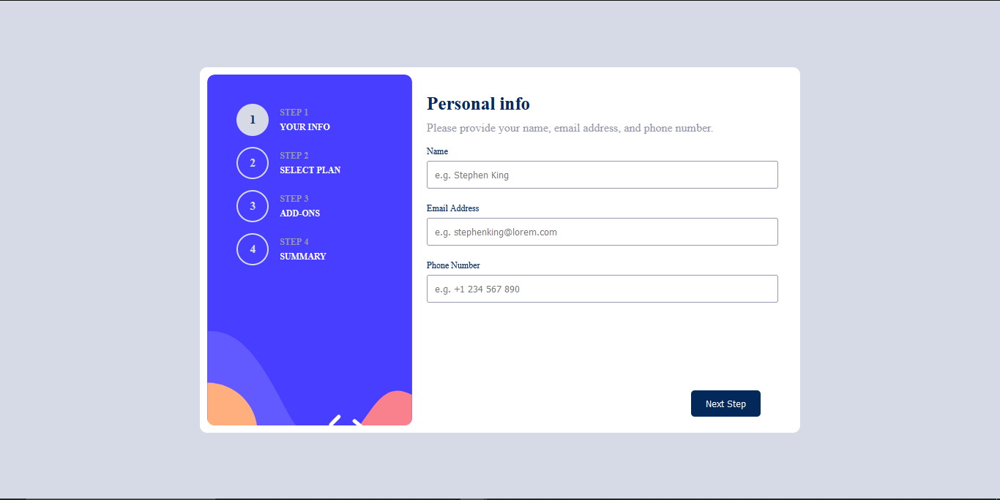

# Frontend Mentor - Multi-step form solution

This is a solution to the [Multi-step form challenge on Frontend Mentor](https://www.frontendmentor.io/challenges/multistep-form-YVAnSdqQBJ). Frontend Mentor challenges help you improve your coding skills by building realistic projects. 

### Screenshot

### Links

- Solution URL: [Solution Page on Frontend Mentor](https://www.frontendmentor.io/solutions/html-css-javascript-responsive-development-mobile-first-dev-a6loyzNSkB)
- Live Site URL: [Live Site](https://multi-step-form-wine-six.vercel.app)

## My process

### Built with

- Semantic HTML5 markup
- CSS custom properties
- Flexbox
- Mobile-first workflow

## Author

- Website - [John Godwin Oamien](https://godwins-portfolio.vercel.app/)
- Frontend Mentor - [Frontend Mentor](https://www.frontendmentor.io/profile/wariboko65)
- LinkedIn - [LinkedIn](https://www.linkedin.com/in/godwin-john-920915206)
